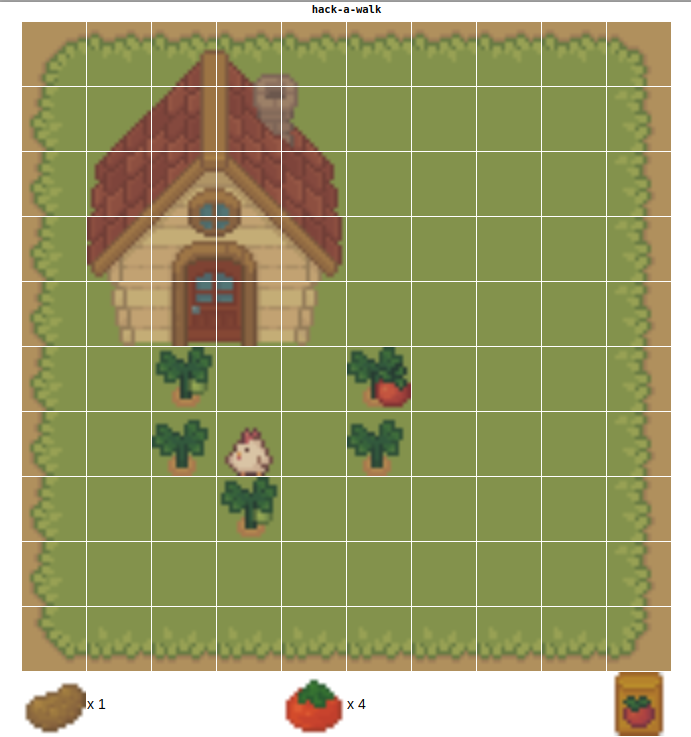

Hack-A-Day is a project I'm doing in November, where I try to make 30 new projects, in 30 days.

# Day 27: Hack-A-Farm

Day 27 is a small farming game. Controls are explained on the page. There is no goal.

Demo available [here](https://tilde.za3k.com/hackaday/farm).

Source available on [github](https://github.com/za3k/day27_farm).

## Credits

- Graphics are from the [Cozy Farm](https://shubibubi.itch.io/cozy-farm) free spritesheet by [shubibubi](https://shubibubi.itch.io/).
